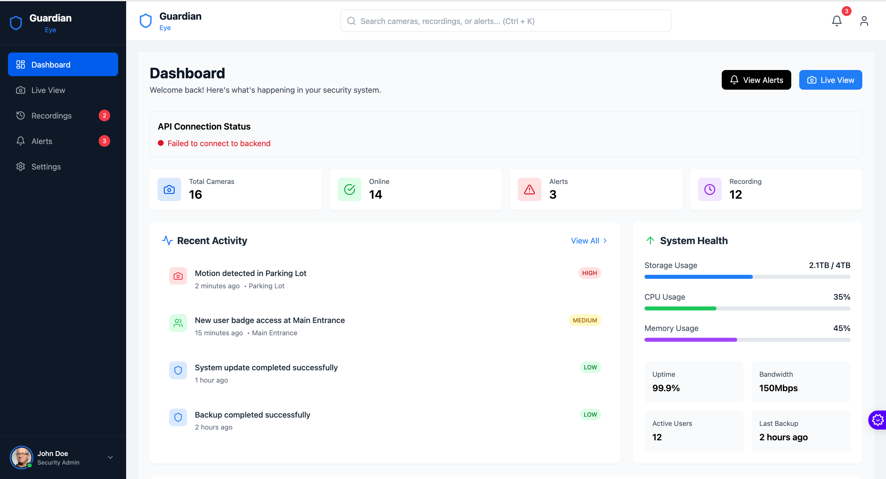
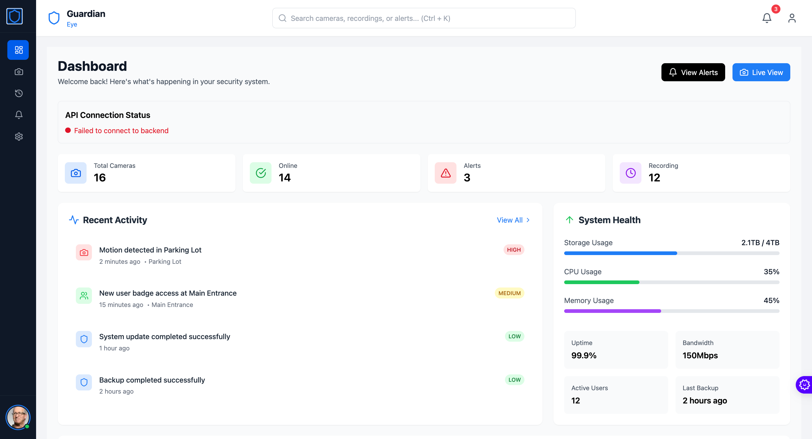
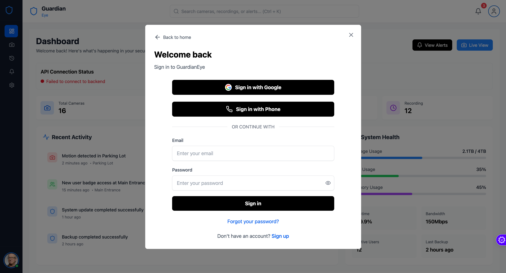
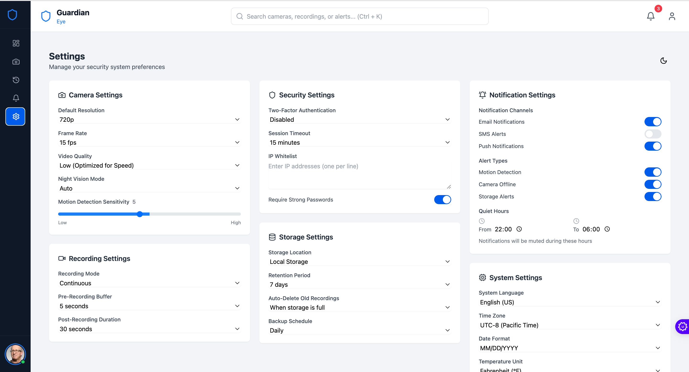
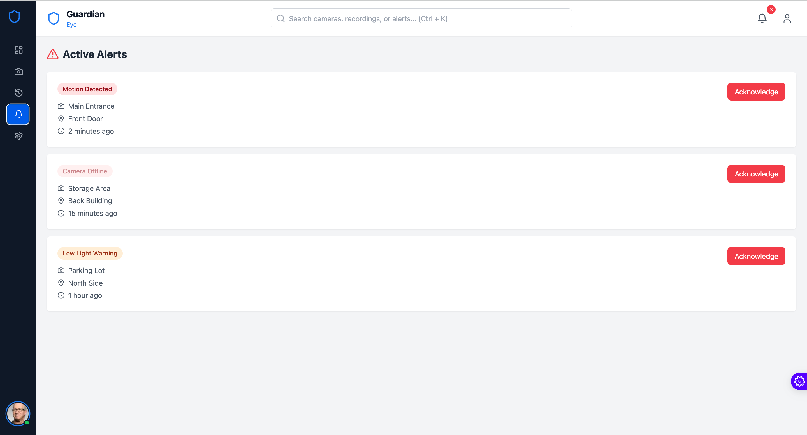
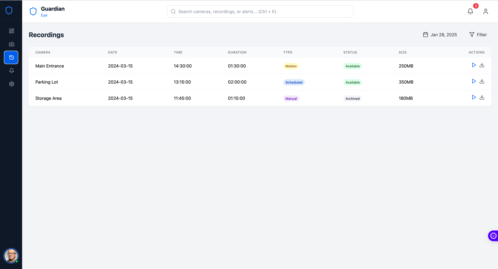

# GuardianEye - Modern Security Camera Monitoring Platform 🎥

[](https://opensource.org/licenses/MIT)

📖 **Project Overview**

GuardianEye is a comprehensive, open-source security camera monitoring platform built with the MERN stack (MongoDB, Express, React, Node.js) and TypeScript. It provides a modern, responsive interface for real-time surveillance, camera management, and alert handling. Whether you're monitoring a home, office, or public space, GuardianEye offers the tools you need to stay secure.

---

🚀 **Features**

*   **Real-Time Live View:** Monitor multiple camera feeds in real-time with a customizable grid layout.
*   **Dashboard Analytics:** Get a quick overview of your security system with key stats and recent activity on the main dashboard.
*   **Event-Based Recordings:** Automatically record and store video clips triggered by motion or other alerts.
*   **Alerts & Notifications:** Receive and manage alerts for important events, ensuring you never miss a critical moment.
*   **User Authentication:** Secure access to the platform with a robust authentication system.
*   **Responsive Design:** Access and manage your cameras from any device, thanks to a clean and responsive UI built with Tailwind CSS.
*   **(Placeholder) Public Feeds:** The original README mentioned viewing public camera feeds from Windy.com API. This feature can be re-integrated or developed.

---

🛠 **Tech Stack**

*   **Frontend:** React, Vite, TypeScript, Tailwind CSS
*   **Backend:** Node.js, Express, MongoDB (with Mongoose)
*   **Authentication:** Firebase (for phone auth), JSON Web Tokens (JWT)

---

⚙️ **Installation & Setup**

Get a local copy of GuardianEye up and running for development.

### Prerequisites

*   Node.js (v16 or higher)
*   npm (v7 or higher)
*   MongoDB instance (local or cloud-based)

### Setup Instructions

1.  **Clone the repository:**
    ```bash
    git clone https://github.com/yourusername/guardianeye.git
    cd guardianeye
    ```

2.  **Configure Backend Environment Variables:**
    In the `server/` directory, create a `.env` file. You will need to add your MongoDB connection string and a secret for signing JWTs.
    ```bash
    # server/.env
    MONGO_URI=your_mongodb_connection_string
    JWT_SECRET=your_super_secret_key
    ```

3.  **Configure Frontend Environment Variables:**
    In the root project directory, create a `.env` file to tell the frontend where to find the backend API.
    ```bash
    # .env
    VITE_API_URL=http://localhost:5000/api
    ```

4.  **Install Dependencies:**
    This project has separate dependencies for the frontend and backend. Open two terminal windows to install them.
    ```bash
    # In your first terminal (project root):
    npm install
    ```
    ```bash
    # In your second terminal (server directory):
    cd server
    npm install
    ```

5.  **Run the Application:**
    You need to run both the frontend and backend servers concurrently in their respective terminals.
    ```bash
    # In your first terminal (project root):
    npm run dev
    ```
    ```bash
    # In your second terminal (server directory):
    npm run dev
    ```

    *   The React frontend will be available at `http://localhost:5173`.
    *   The Node.js backend will be available at `http://localhost:5000`.

---

📸 **Screenshots**

Here are some screenshots of the GuardianEye application in action.

| Dashboard | Live View |
| :---: | :---: |
|  |  |

| Recordings | Alerts |
| :---: | :---: |
|  |  |

| Mobile View | Settings |
| :---: | :---: |
|  |  |

---

📅 **Roadmap**

*   **Q3 2024:** Finalize core features (Live View, Recordings, Alerts).
*   **Q4 2024:** Implement advanced camera controls (PTZ - Pan, Tilt, Zoom).
*   **Q1 2025:** Develop a mobile application with React Native.
*   **Q2 2025:** Integrate with external services like cloud storage for recordings.

---

🤝 **Contributing**

Contributions are welcome! Please open an issue to discuss any changes before submitting a pull request.

1.  Fork the Project
2.  Create your Feature Branch (`git checkout -b feature/NewFeature`)
3.  Commit your Changes (`git commit -m 'Add some NewFeature'`)
4.  Push to the Branch (`git push origin feature/NewFeature`)
5.  Open a Pull Request

---

📜 **License**

This project is licensed under the MIT License.
